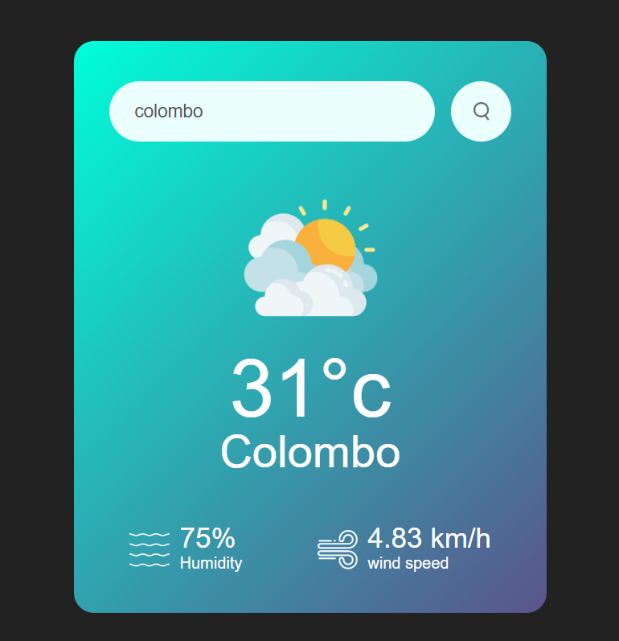

# Weather App 🌤️

A simple weather application that fetches real-time weather data using the OpenWeatherMap API.

## 🌟 Features
- Get current temperature, humidity, and wind speed.
- Displays weather conditions with relevant icons.
- Search for any city worldwide.
- User-friendly UI with a responsive design.

## 📸 Screenshots


## 🚀 Technologies Used
- **HTML** - Structure of the app.
- **CSS** - Styling and responsive design.
- **JavaScript** - Fetching data and updating UI dynamically.
- **OpenWeatherMap API** - Provides real-time weather data.

## 🔧 Setup Instructions
1. Clone the repository:
   ```bash
   git clone https://github.com/ashentharushikez/weather-app.git
   cd weather-app
